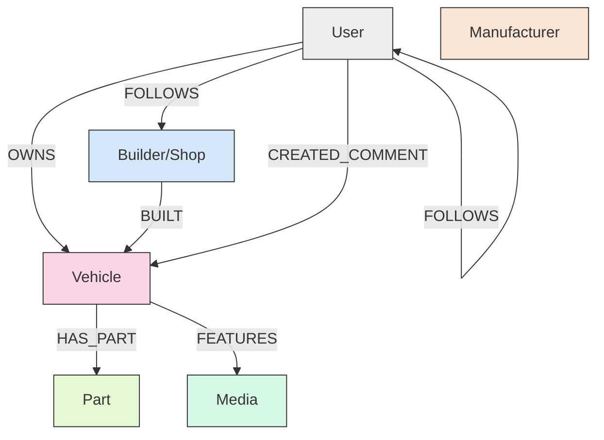
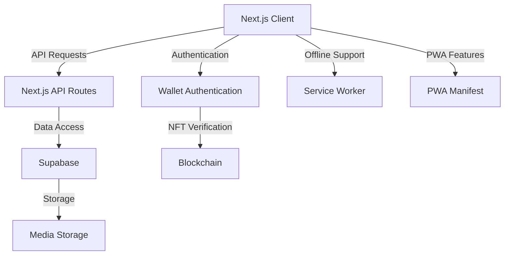
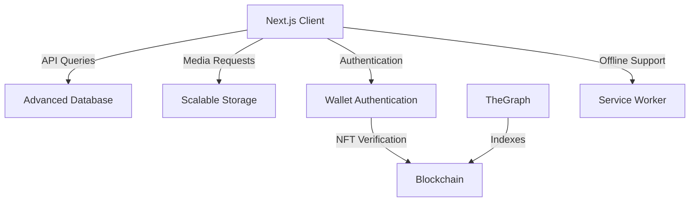

# Carstarz Vehicle Registry Redesign Plan

## Executive Summary

This document outlines a comprehensive plan for redesigning the Carstarz Vehicle Registry application to create a robust, scalable platform that connects vehicle owners, builders, parts, and shops through a well-structured relational database. The redesign will focus on creating a best-in-class Progressive Web App (PWA) experience while maintaining the NFT integration under the hood, with a future migration path to more advanced storage solutions once the platform reaches 1000+ daily active users.

## Vision

Carstarz will be a social platform centered around vehicle profiles, where:

- Vehicle owners can showcase their vehicles with rich media and detailed specifications
- Vehicle profiles serve as shareable content for social media (especially Instagram)
- Profiles link to parts (enabling affiliate revenue) and shops that did work on the vehicle
- The platform creates value through well-defined relationships between vehicles, owners, builders, parts, and shops
- A freemium model allows basic usage for free with tiered subscriptions for enhanced features

## Current Pain Points

1. **Authentication issues** with wallet address handling causing user experience problems
2. **Media management** needs improvement for better handling of high-quality images and videos
3. **Application structure** is becoming difficult to maintain and scale as new features are added

## Redesign Priorities

1. Restructure the application with a well-designed relational database model
2. Implement PWA capabilities with offline support
3. Fix authentication issues
4. Improve media management
5. Design with future scalability in mind

## Relational Database Model

The core of the redesign is a relational database model that represents entities and their relationships through Supabase tables:

## Detailed Database Model

### Core Tables

1. **Vehicle**
   - Properties:
     - token_id (NFT identifier)
     - vin (Vehicle Identification Number)
     - make
     - model
     - year
     - name (custom name)
     - description

2. **User**
   - Properties:
     - wallet_address
     - user_type (owner, builder, manufacturer)
     - subscription_tier
     - profile_data (name, bio, etc.)

3. **Builder/Shop**
   - Properties:
     - business_name
     - business_type
     - contact_info
     - subscription_tier
     - specialties
4. **Part** (Simplified for MVP)
   - Properties:
      - category
      - description
      - link

// Manufacturer entity removed for MVP simplification

6. **Media**
   - Properties:
     - url
     - type (image, video)
     - caption
     - is_featured

### Core Edges (Relationships)

1. **OWNS**
   - From: User (Owner)
   - To: Vehicle
   - Properties:
     - ownership_date
     - is_primary_owner

2. **BUILT** (Simplified for MVP)
   - From: Builder/Shop
   - To: Vehicle
   - Properties:
      - build_date
      - build_description

3. **HAS_PART** (Simplified for MVP)
   - From: Vehicle
   - To: Part
   - Properties:
      - description

5. **FEATURES**
   - From: Vehicle
   - To: Media
   - Properties:
     - upload_date
     - context (e.g., "before modification", "after modification")

### Integration Edges (Relationships)

1. **INVITES**
   - From: Builder/Shop
   - To: User (Owner)
   - Properties:
     - invitation_date
     - status (sent, accepted, expired)
     - message

3. **FOLLOWS**
   - From: User
   - To: User/Builder/Shop
   - Properties:
     - follow_date

4. **RECOMMENDS**
   - From: User/Builder
   - To: Part/Builder/Vehicle
   - Properties:
     - recommendation_date
     - rating
     - review_text

5. **COLLABORATED_ON**
   - From: Builder/Shop
   - To: Vehicle
   - With: Builder/Shop
   - Properties:
     - collaboration_date
     - contribution_description



### Entity Types

1. **Vehicle** (Core Entity)
   - NFT-backed with token ID
   - Rich profile with specifications, description, and media
   - Links to owners, builders, and parts

2. **Owner**
   - Wallet address authentication
   - Controls vehicle profiles
   - Can own multiple vehicles based on subscription tier

3. **Builder/Shop**
   - Professional entity that builds or modifies vehicles
   - Portfolio of vehicles they've worked on
   - Tiered subscription options

4. **Parts** (Simplified for MVP)
   - Basic categorization
   - User description
   - External link

### Relationships

#### Core Relationships
- **Vehicle-Owner**: Ownership relationship (NFT-based)
- **Vehicle-Builder**: Simple built-by relationship (who created/modified the vehicle)
- **Vehicle-Parts**: Basic parts list with categories and links
- **Builder-Vehicle**: Simple portfolio relationship (showcasing work)

#### Integration Relationships (Simplified for MVP)
- **User-User/Builder**: Basic following relationship
  - Users can follow other users or builders
  - Creates social graph foundation
  
- **Comments**: Basic commenting functionality
  - Users can comment on vehicles
  - Creates engagement foundation

## Freemium Business Model

### User Tiers

1. **Free Tier**
   - Create a profile
   - Mint 1 vehicle with basic features
   - View all content on the platform
   - Basic social interactions (comments, likes)

2. **Standard Tier** ($4.99/month)
   - 1-3 vehicles
   - Advanced features (enhanced media galleries, custom fields)
   - Affiliate marketing options
   - Analytics dashboard
   - Priority support

3. **Collector Tier** ($24.99/month)
   - 4-9 vehicles
   - All standard tier features
   - Enhanced analytics
   - Custom branding options
   - Featured placement in discovery

4. **Investor Tier** ($99/month)
   - 10+ vehicles
   - All collector tier features
   - API access
   - White-label options
   - Dedicated support

### Builder/Shop/Company Tiers

1. **Builder/Shop Standard** ($99/month)
   - Professional profile
   - Portfolio showcase (unlimited vehicles)
   - Business contact information
   - Advanced analytics
   - **Integration Features:**
     - Send invitation links to customers to create vehicles
     - Link customer vehicles to builder portfolio
     - Request connection to existing vehicle owners
     - Receive connection requests from vehicle owners
     - Collaborative build documentation

2. **Builder/Shop Pro** ($199/month)
   - All Standard features
   - Featured placement in builder directory
   - Appointment booking system
   - Lead generation tools
   - Custom branding options
   - **Enhanced Integration:**
     - Bulk invitation management
     - Customer relationship management tools
     - Build progress tracking and sharing
     - Parts recommendation engine

3. **Enterprise** (Custom pricing)
   - All Pro features
   - White-label solutions
   - API integration
   - Custom features
   - Dedicated account manager
   - Marketing partnership opportunities
   - **Advanced Integration:**
     - Custom workflow automation
     - Integration with shop management software
     - Customer loyalty program tools

### Manufacturer/Brand Tiers

1. **Brand Presence** ($199/month)
   - Official brand profile
   - Product catalog integration
   - Analytics on product mentions/usage
   - Verified status

2. **Brand Partner** ($499/month)
   - All Brand Presence features
   - Featured placement in parts discovery
   - Direct messaging with vehicle owners
   - Co-marketing opportunities
   - API access

## Technical Architecture

### Phase 1: PWA with Traditional Backend (MVP)



#### Database Strategy: Optimized Relational Model

For the MVP phase, we'll implement a well-structured relational database approach:

1. **Supabase PostgreSQL Implementation**
   - Implement core functionality using standard PostgreSQL tables in Supabase
   - Focus on essential entities and relationships only
   - Design schema with performance and scalability in mind

2. **Core Functionality Focus**
   - Prioritize vehicle profiles, ownership, and basic builder connections
   - Implement only the most critical relationships needed for MVP features
   - Use junction tables for many-to-many relationships

3. **Scalable Schema Design**
   - Document schema relationships clearly in code and comments
   - Use consistent ID strategies and naming conventions
   - Implement proper foreign key constraints

4. **Performance Considerations**
   - Use materialized views for common query patterns
   - Implement strategic denormalization where appropriate
   - Add indexes for all relationship fields and frequently queried columns

This approach allows us to:
- Launch quickly with familiar technology (PostgreSQL)
- Validate core business assumptions with minimal technical complexity
- Scale efficiently with proven relational database patterns
- Maintain performance during the critical early growth phase

#### Components

1. **Frontend**
   - Next.js application with App Router
   - Tailwind CSS for styling
   - PWA implementation with service workers
   - Offline support for critical features
   - Mobile-first responsive design

   **Frontend Performance Optimization (MVP Focus)**
   
   Given our simplified data model approach for MVP, we'll focus on these key performance areas:
   
   a. **Core Performance Fundamentals**
   - Image optimization and lazy loading
   - Efficient pagination of vehicle listings (cursor-based)
   - Mobile-first responsive design with adaptive layouts
   - Code splitting and dynamic imports for faster initial load
   
   b. **Simplified Data Loading**
   - Fetch only essential data for initial renders
   - Implement "load more" patterns instead of resource-intensive infinite scroll
   - Use simple list/grid views rather than complex relationship visualizations
   - Minimize unnecessary re-renders with React.memo and useMemo
   
   c. **Media Experience Optimization**
   - Progressive image loading with blur placeholders
   - Responsive image sizing with srcset and sizes attributes
   - Thumbnail generation and caching
   - WebP image format with fallbacks for older browsers

2. **Backend**
   - Next.js API routes
   - Supabase for data storage
   - Relational model designed to support future graph migration
   - Improved authentication flow

3. **Authentication and Identity Management**
   - Environment-specific authentication strategy:
     - Burner Wallets for development environment
     - Magic Link or Coinbase Smart Wallets for production
   - Consistent lowercase handling of wallet addresses
   - Session management with Supabase Auth
   - Human-readable username system

#### Tiered Authentication Strategy

To address the challenges of wallet-based identity while maintaining development flexibility:

1. **Development Environment: Burner Wallets**
   - Continue using Burner Wallets for rapid development and testing
   - Local storage-based key management
   - Simplified developer experience
   - No external dependencies during development

2. **Production Environment: Magic Link Integration**
   - Email-based magic links for seamless login in production
   - Familiar authentication flow for non-crypto users
   - Built-in account recovery via email
   - Optional social login integration

3. **Production Alternative: Coinbase Smart Wallet**
   - Integration with Coinbase's Smart Wallet SDK
   - Leverages Coinbase's security and user experience
   - Wider adoption potential through established brand

4. **Implementation Approach**
   ```javascript
   // Environment-aware authentication
   import { Magic } from 'magic-sdk';
   import { BurnerConnector } from '~/lib/connectors/BurnerConnector';
   import { CoinbaseWalletConnector } from '@wagmi/connectors/coinbaseWallet';
   
   // Select authentication method based on environment
   const getAuthMethod = () => {
     if (process.env.NODE_ENV === 'development') {
       return new BurnerConnector(); // Use Burner Wallet in development
     } else {
       // In production, offer Magic Link or Coinbase Smart Wallet
       const useMagicLink = true; // Toggle based on configuration
       
       if (useMagicLink) {
         return new Magic('YOUR_MAGIC_API_KEY');
       } else {
         return new CoinbaseWalletConnector({
           options: {
             appName: 'Carstarz',
             jsonRpcUrl: process.env.NEXT_PUBLIC_RPC_URL,
           },
         });
       }
     }
   };
   ```

#### Human-Readable Username System

Regardless of the authentication method, we'll implement a simple username system:

1. **Database Implementation**
   - Add `username` field to users table
   - Create unique constraints for usernames
   - Add validation rules (alphanumeric, length limits)

2. **Schema Updates**
   ```sql
   -- Update users table to include username
   ALTER TABLE users ADD COLUMN username VARCHAR(30) UNIQUE;
   
   -- Create index for username lookups
   CREATE INDEX idx_users_username ON users(username);
   ```

3. **User Experience**
   - Username selection during onboarding
   - Display usernames instead of addresses in UI
   - Username search functionality
   
4. **Benefits**
   - Consistent user identity across environments
   - Human-readable identifiers regardless of auth method
   - Simplified user interactions and mentions

4. **Media Management**
   - Improved image/video handling
   - Compression and optimization
   - Responsive images
   - Lazy loading
   - Enhanced upload experience

5. **Subscription Management**
   - Tier-based access control
   - Payment processing integration
   - Subscription lifecycle management

### Phase 2: Migration to Web3 (Post 1000+ DAU)



#### Components

1. **Advanced Database Integration**
   - Database optimization for indexing vehicle data
   - REST API for querying the relational database
   - Maintaining relationships between entities

2. **Scalable Media Storage**
   - Optimized storage for images and videos
   - Content addressing for media assets
   - Caching strategy for performance

## Implementation Plan

## Data Verification and Quality Control

To address potential issues with data completeness and quality in our relational database model, we will implement the following measures:

### 1. Standardized Templates for Common Modifications

We will create a library of standardized templates for common vehicle modifications to ensure consistency and accuracy:

- **Pre-defined Modification Categories**: Organize modifications into categories (engine, suspension, exterior, etc.)
- **Structured Data Fields**: Each modification type will have specific required and optional fields
- **Manufacturer-Specific Templates**: Templates tailored to common modifications for specific vehicle makes/models
- **Visual Selection Interface**: Allow users to select modifications from visual catalogs rather than free-form entry
- **Validation Rules**: Implement validation rules to ensure logical consistency (e.g., compatible parts)

Example template for an engine modification:
```json
{
  "modification_type": "engine_upgrade",
  "fields": {
    "required": [
      {"name": "component_type", "type": "select", "options": ["turbocharger", "supercharger", "intake", "exhaust", "ecu_tune"]},
      {"name": "manufacturer", "type": "text"},
      {"name": "part_number", "type": "text"}
    ],
    "optional": [
      {"name": "installation_date", "type": "date"},
      {"name": "installed_by", "type": "builder_reference"},
      {"name": "performance_gains", "type": "object", "properties": {
        "horsepower_increase": {"type": "number"},
        "torque_increase": {"type": "number"}
      }},
      {"name": "notes", "type": "text_area"}
    ]
  }
}
```

### 2. Minimal Dispute Resolution Process

We will implement a streamlined dispute resolution process for contested relationships and data:

- **Claim Verification**: Simple process for users to verify they are associated with a build or shop
- **Flagging System**: Allow users to flag potentially incorrect information
- **Builder Verification**: Process for builders to verify they worked on specific vehicles
- **Mediation Process**: Lightweight mediation for disputes between owners and builders
- **Trust Signals**: Visual indicators showing verified vs. unverified relationships

The dispute resolution workflow:
1. User flags disputed content or relationship
2. System notifies all involved parties
3. Parties can provide evidence (photos, receipts, communications)
4. If resolved by parties: system updates relationship status
5. If unresolved after 7 days: platform admin reviews evidence and makes determination
6. Resolution is implemented and parties are notified

### 3. Third-Party Data Source Integration

We will integrate with trusted third-party data sources to improve data quality:

- **VIN API Integration**: Connect with vehicle databases to auto-populate stock vehicle configurations
- **Vehicle Specifications Database**: Integrate with automotive databases for accurate base specifications
- **Parts Compatibility APIs**: Connect with parts databases to verify compatibility
- **Image Recognition**: Use computer vision to help identify modifications from photos
- **Manufacturer Data**: Partner with manufacturers for official parts data

Implementation approach:
- Primary integration with NHTSA VIN Decoder API for basic vehicle information
- Secondary integration with commercial APIs like CarMD or CARFAX for additional data
- Create a data enrichment pipeline that automatically enhances user-provided information
- Implement a caching strategy to minimize API costs while maintaining data freshness

These measures will significantly improve data quality while maintaining a smooth user experience and minimizing friction in the content creation process.

## Supabase Database Schema

The following Supabase (PostgreSQL) schema will implement our relational database model:

### Core Entity Tables

```sql
-- Enable UUID extension
CREATE EXTENSION IF NOT EXISTS "uuid-ossp";

-- Vehicle Profiles Table
CREATE TABLE vehicle_profiles (
    id UUID PRIMARY KEY DEFAULT uuid_generate_v4(),
    token_id INTEGER NOT NULL UNIQUE,  -- NFT token ID
    vin VARCHAR(17) UNIQUE,            -- Vehicle Identification Number
    make VARCHAR(100) NOT NULL,
    model VARCHAR(100) NOT NULL,
    year INTEGER NOT NULL,
    name VARCHAR(100),                 -- Custom vehicle name
    description TEXT,
    created_at TIMESTAMP WITH TIME ZONE DEFAULT CURRENT_TIMESTAMP,
    updated_at TIMESTAMP WITH TIME ZONE DEFAULT CURRENT_TIMESTAMP
);

-- Users Table
CREATE TABLE users (
    wallet_address TEXT PRIMARY KEY,
    user_type VARCHAR(20) NOT NULL CHECK (user_type IN ('owner', 'builder', 'manufacturer')),
    subscription_tier VARCHAR(20) NOT NULL DEFAULT 'free',
    subscription_start_date TIMESTAMP WITH TIME ZONE,
    subscription_end_date TIMESTAMP WITH TIME ZONE,
    profile_data JSONB DEFAULT '{}',
    created_at TIMESTAMP WITH TIME ZONE DEFAULT CURRENT_TIMESTAMP,
    updated_at TIMESTAMP WITH TIME ZONE DEFAULT CURRENT_TIMESTAMP
);

-- Builders/Shops Table
CREATE TABLE builders (
    id UUID PRIMARY KEY DEFAULT uuid_generate_v4(),
    wallet_address TEXT NOT NULL REFERENCES users(wallet_address) ON DELETE CASCADE,
    business_name VARCHAR(100) NOT NULL,
    business_type VARCHAR(50) NOT NULL,
    contact_info JSONB DEFAULT '{}',
    specialties TEXT[],
    subscription_tier VARCHAR(20) NOT NULL DEFAULT 'standard',
    created_at TIMESTAMP WITH TIME ZONE DEFAULT CURRENT_TIMESTAMP,
    updated_at TIMESTAMP WITH TIME ZONE DEFAULT CURRENT_TIMESTAMP
);

-- Parts Table (Simplified for MVP)
CREATE TABLE parts (
    id UUID PRIMARY KEY DEFAULT uuid_generate_v4(),
    category VARCHAR(100) NOT NULL,
    description TEXT,
    link TEXT,
    created_at TIMESTAMP WITH TIME ZONE DEFAULT CURRENT_TIMESTAMP,
    updated_at TIMESTAMP WITH TIME ZONE DEFAULT CURRENT_TIMESTAMP
);

-- Manufacturers Table removed for MVP simplification

-- Media Table
CREATE TABLE media (
    id UUID PRIMARY KEY DEFAULT uuid_generate_v4(),
    url TEXT NOT NULL,
    type VARCHAR(10) NOT NULL CHECK (type IN ('image', 'video')),
    caption TEXT,
    is_featured BOOLEAN DEFAULT false,
    created_at TIMESTAMP WITH TIME ZONE DEFAULT CURRENT_TIMESTAMP,
    updated_at TIMESTAMP WITH TIME ZONE DEFAULT CURRENT_TIMESTAMP
);
```

### Relationship Tables (Edges)

```sql
-- Vehicle Ownership (OWNS relationship)
CREATE TABLE vehicle_ownership (
    id UUID PRIMARY KEY DEFAULT uuid_generate_v4(),
    vehicle_id UUID NOT NULL REFERENCES vehicle_profiles(id) ON DELETE CASCADE,
    owner_wallet TEXT NOT NULL REFERENCES users(wallet_address) ON DELETE CASCADE,
    ownership_date TIMESTAMP WITH TIME ZONE DEFAULT CURRENT_TIMESTAMP,
    is_primary_owner BOOLEAN DEFAULT true,
    created_at TIMESTAMP WITH TIME ZONE DEFAULT CURRENT_TIMESTAMP,
    updated_at TIMESTAMP WITH TIME ZONE DEFAULT CURRENT_TIMESTAMP,
    UNIQUE(vehicle_id, owner_wallet)
);

-- Vehicle Builders (BUILT relationship)
CREATE TABLE vehicle_builders (
    id UUID PRIMARY KEY DEFAULT uuid_generate_v4(),
    vehicle_id UUID NOT NULL REFERENCES vehicle_profiles(id) ON DELETE CASCADE,
    builder_id UUID NOT NULL REFERENCES builders(id) ON DELETE CASCADE,
    build_type VARCHAR(50) NOT NULL CHECK (build_type IN ('full_build', 'modification', 'maintenance')),
    build_date TIMESTAMP WITH TIME ZONE,
    build_description TEXT,
    created_at TIMESTAMP WITH TIME ZONE DEFAULT CURRENT_TIMESTAMP,
    updated_at TIMESTAMP WITH TIME ZONE DEFAULT CURRENT_TIMESTAMP
);

-- Vehicle Parts (HAS_PART relationship - Simplified for MVP)
CREATE TABLE vehicle_parts (
    id UUID PRIMARY KEY DEFAULT uuid_generate_v4(),
    vehicle_id UUID NOT NULL REFERENCES vehicle_profiles(id) ON DELETE CASCADE,
    part_id UUID NOT NULL REFERENCES parts(id) ON DELETE CASCADE,
    description TEXT,
    created_at TIMESTAMP WITH TIME ZONE DEFAULT CURRENT_TIMESTAMP,
    updated_at TIMESTAMP WITH TIME ZONE DEFAULT CURRENT_TIMESTAMP
);

-- Vehicle Media (FEATURES relationship)
CREATE TABLE vehicle_media (
    id UUID PRIMARY KEY DEFAULT uuid_generate_v4(),
    vehicle_id UUID NOT NULL REFERENCES vehicle_profiles(id) ON DELETE CASCADE,
    media_id UUID NOT NULL REFERENCES media(id) ON DELETE CASCADE,
    context VARCHAR(50),
    upload_date TIMESTAMP WITH TIME ZONE DEFAULT CURRENT_TIMESTAMP,
    created_at TIMESTAMP WITH TIME ZONE DEFAULT CURRENT_TIMESTAMP,
    updated_at TIMESTAMP WITH TIME ZONE DEFAULT CURRENT_TIMESTAMP
);

-- Builder Invitations (INVITES relationship)
CREATE TABLE builder_invitations (
    id UUID PRIMARY KEY DEFAULT uuid_generate_v4(),
    builder_id UUID NOT NULL REFERENCES builders(id) ON DELETE CASCADE,
    invited_email TEXT NOT NULL,
    invited_wallet TEXT REFERENCES users(wallet_address),
    vehicle_id UUID REFERENCES vehicle_profiles(id),
    status VARCHAR(20) NOT NULL DEFAULT 'sent' CHECK (status IN ('sent', 'accepted', 'expired')),
    message TEXT,
    invitation_date TIMESTAMP WITH TIME ZONE DEFAULT CURRENT_TIMESTAMP,
    expires_at TIMESTAMP WITH TIME ZONE,
    created_at TIMESTAMP WITH TIME ZONE DEFAULT CURRENT_TIMESTAMP,
    updated_at TIMESTAMP WITH TIME ZONE DEFAULT CURRENT_TIMESTAMP
);

-- Service Requests (REQUESTS_SERVICE relationship)
CREATE TABLE service_requests (
    id UUID PRIMARY KEY DEFAULT uuid_generate_v4(),
    owner_wallet TEXT NOT NULL REFERENCES users(wallet_address) ON DELETE CASCADE,
    builder_id UUID NOT NULL REFERENCES builders(id) ON DELETE CASCADE,
    vehicle_id UUID REFERENCES vehicle_profiles(id),
    service_type VARCHAR(50) NOT NULL,
    status VARCHAR(20) NOT NULL DEFAULT 'pending' CHECK (status IN ('pending', 'accepted', 'completed', 'rejected')),
    message TEXT,
    request_date TIMESTAMP WITH TIME ZONE DEFAULT CURRENT_TIMESTAMP,
    created_at TIMESTAMP WITH TIME ZONE DEFAULT CURRENT_TIMESTAMP,
    updated_at TIMESTAMP WITH TIME ZONE DEFAULT CURRENT_TIMESTAMP
);

-- Follows (FOLLOWS relationship)
CREATE TABLE follows (
    follower_wallet TEXT NOT NULL REFERENCES users(wallet_address) ON DELETE CASCADE,
    following_wallet TEXT NOT NULL REFERENCES users(wallet_address) ON DELETE CASCADE,
    follow_date TIMESTAMP WITH TIME ZONE DEFAULT CURRENT_TIMESTAMP,
    PRIMARY KEY (follower_wallet, following_wallet)
);

-- Recommendations (RECOMMENDS relationship)
CREATE TABLE recommendations (
    id UUID PRIMARY KEY DEFAULT uuid_generate_v4(),
    recommender_wallet TEXT NOT NULL REFERENCES users(wallet_address) ON DELETE CASCADE,
    entity_type VARCHAR(20) NOT NULL CHECK (entity_type IN ('builder', 'part', 'vehicle')),
    entity_id UUID NOT NULL,
    rating INTEGER CHECK (rating BETWEEN 1 AND 5),
    review_text TEXT,
    recommendation_date TIMESTAMP WITH TIME ZONE DEFAULT CURRENT_TIMESTAMP,
    created_at TIMESTAMP WITH TIME ZONE DEFAULT CURRENT_TIMESTAMP,
    updated_at TIMESTAMP WITH TIME ZONE DEFAULT CURRENT_TIMESTAMP
);

-- Builder Collaborations (COLLABORATED_ON relationship)
CREATE TABLE builder_collaborations (
    id UUID PRIMARY KEY DEFAULT uuid_generate_v4(),
    vehicle_id UUID NOT NULL REFERENCES vehicle_profiles(id) ON DELETE CASCADE,
    primary_builder_id UUID NOT NULL REFERENCES builders(id) ON DELETE CASCADE,
    collaborator_id UUID NOT NULL REFERENCES builders(id) ON DELETE CASCADE,
    collaboration_date TIMESTAMP WITH TIME ZONE,
    contribution_description TEXT,
    created_at TIMESTAMP WITH TIME ZONE DEFAULT CURRENT_TIMESTAMP,
    updated_at TIMESTAMP WITH TIME ZONE DEFAULT CURRENT_TIMESTAMP,
    CHECK (primary_builder_id != collaborator_id)
);

-- Comments (CREATED_COMMENT relationship)
CREATE TABLE vehicle_comments (
    id UUID PRIMARY KEY DEFAULT uuid_generate_v4(),
    vehicle_id UUID NOT NULL REFERENCES vehicle_profiles(id) ON DELETE CASCADE,
    user_wallet TEXT NOT NULL REFERENCES users(wallet_address) ON DELETE CASCADE,
    content TEXT NOT NULL,
    created_at TIMESTAMP WITH TIME ZONE DEFAULT CURRENT_TIMESTAMP,
    updated_at TIMESTAMP WITH TIME ZONE DEFAULT CURRENT_TIMESTAMP
);
```

### Indexes for Performance

```sql
-- Core entity indexes
CREATE INDEX idx_vehicle_profiles_token_id ON vehicle_profiles(token_id);
CREATE INDEX idx_vehicle_profiles_make_model_year ON vehicle_profiles(make, model, year);
CREATE INDEX idx_users_user_type ON users(user_type);
CREATE INDEX idx_users_subscription_tier ON users(subscription_tier);
CREATE INDEX idx_builders_wallet_address ON builders(wallet_address);
CREATE INDEX idx_builders_business_name ON builders(business_name);
CREATE INDEX idx_parts_name ON parts(name);
CREATE INDEX idx_parts_manufacturer_id ON parts(manufacturer_id);
CREATE INDEX idx_manufacturers_name ON manufacturers(name);
CREATE INDEX idx_media_type ON media(type);

-- Relationship indexes
CREATE INDEX idx_vehicle_ownership_vehicle_id ON vehicle_ownership(vehicle_id);
CREATE INDEX idx_vehicle_ownership_owner_wallet ON vehicle_ownership(owner_wallet);
CREATE INDEX idx_vehicle_builders_vehicle_id ON vehicle_builders(vehicle_id);
CREATE INDEX idx_vehicle_builders_builder_id ON vehicle_builders(builder_id);
CREATE INDEX idx_vehicle_parts_vehicle_id ON vehicle_parts(vehicle_id);
CREATE INDEX idx_vehicle_parts_part_id ON vehicle_parts(part_id);
CREATE INDEX idx_vehicle_media_vehicle_id ON vehicle_media(vehicle_id);
CREATE INDEX idx_vehicle_media_media_id ON vehicle_media(media_id);
CREATE INDEX idx_builder_invitations_builder_id ON builder_invitations(builder_id);
CREATE INDEX idx_builder_invitations_invited_wallet ON builder_invitations(invited_wallet);
CREATE INDEX idx_service_requests_owner_wallet ON service_requests(owner_wallet);
CREATE INDEX idx_service_requests_builder_id ON service_requests(builder_id);
CREATE INDEX idx_follows_follower_wallet ON follows(follower_wallet);
CREATE INDEX idx_follows_following_wallet ON follows(following_wallet);
CREATE INDEX idx_recommendations_recommender_wallet ON recommendations(recommender_wallet);
CREATE INDEX idx_recommendations_entity_type_id ON recommendations(entity_type, entity_id);
CREATE INDEX idx_builder_collaborations_vehicle_id ON builder_collaborations(vehicle_id);
CREATE INDEX idx_builder_collaborations_primary_builder_id ON builder_collaborations(primary_builder_id);
CREATE INDEX idx_builder_collaborations_collaborator_id ON builder_collaborations(collaborator_id);
CREATE INDEX idx_vehicle_comments_vehicle_id ON vehicle_comments(vehicle_id);
CREATE INDEX idx_vehicle_comments_user_wallet ON vehicle_comments(user_wallet);
```

## Knowledge Graph: Key Relationships Model

For our relational database model, we'll implement a comprehensive set of relationships through well-designed tables and foreign key constraints that provide rich functionality while ensuring the system remains expandable. Here are the key relationships prioritized for implementation in our Supabase PostgreSQL database:

### Core Vehicle Relationships

1. **OWNS** (User → Vehicle)
   - **Definition**: Represents ownership of a vehicle by a user
   - **Properties**:
     - ownership_date: When the ownership began
     - is_primary_owner: Whether this is the primary owner
     - purchase_price: Optional purchase price information
   - **Table**: `vehicle_ownership`

2. **PREVIOUSLY_OWNED** (User → Vehicle)
   - **Definition**: Represents previous ownership of a vehicle
   - **Properties**:
     - ownership_start: When ownership began
     - ownership_end: When ownership ended
     - reason: Reason for ending ownership (sold, traded, etc.)
   - **Table**: `vehicle_previous_owners`

### Media Ownership and Credit Relationships

3. **OWNS_MEDIA** (User → Media)
   - **Definition**: Represents ownership of media by a user
   - **Properties**:
     - creation_date: When the media was created/uploaded
     - copyright_info: Copyright information
     - usage_rights: How the media can be used
   - **Table**: `user_media`
   - **Note**: This relationship ensures media ownership remains with the user even when vehicle ownership changes

4. **CREDITED_FOR_MEDIA** (User → Media)
   - **Definition**: Credits a user (photographer/videographer) for creating the media
   - **Properties**:
     - credit_type: Type of credit (photographer, videographer, editor, etc.)
     - credit_text: How the credit should be displayed
     - compensation_info: Optional information about compensation
     - permission_type: Usage permissions granted by the creator
   - **Table**: `media_credits`
   - **Note**: This allows proper attribution to creators who may be different from the media owner

5. **FEATURES** (Vehicle → Media)
   - **Definition**: Associates media with a vehicle (without implying ownership)
   - **Properties**:
     - context: Purpose of the media (e.g., "exterior", "interior", "engine")
     - is_featured: Whether this is a featured image
     - display_order: Order for display in gallery
     - added_by: User who added this media to the vehicle
     - added_date: When the media was associated with the vehicle
   - **Table**: `vehicle_media`
   - **Note**: This relationship allows media to be associated with vehicles while maintaining separate ownership

### Parts Documentation Relationships

6. **HAS_PART** (Vehicle → Part)
   - **Definition**: Indicates that a vehicle has a specific part installed
   - **Properties**:
     - installation_date: When the part was installed
     - installed_by: Who installed the part (reference to builder)
     - condition: Condition of the part (new, used, refurbished)
     - purchase_price: Optional price information
   - **Table**: `vehicle_parts`

7. **HAD_PART** (Vehicle → Part)
   - **Definition**: Indicates a part that was previously installed but removed
   - **Properties**:
     - installation_date: When the part was installed
     - removal_date: When the part was removed
     - reason: Reason for removal (upgrade, failure, etc.)
   - **Table**: `vehicle_previous_parts`

8. **HAS_PART_DOCUMENTATION** (Vehicle → PartDocumentation)
   - **Definition**: Associates parts documentation with a vehicle
   - **Properties**:
     - documentation_type: Type of documentation (manual, receipt, warranty, installation photos)
     - part_id: Reference to the part being documented
     - creation_date: When the documentation was created
     - created_by: Original creator (for attribution only, not ownership)
   - **Table**: `vehicle_part_documentation`
   - **Note**: Unlike regular media, parts documentation transfers with the vehicle when ownership changes

### Club Relationships

14. **CREATES_CLUB** (User → Club)
    - **Definition**: User creates and administers a car club
    - **Properties**:
      - creation_date: When the club was created
      - club_name: Name of the club
      - club_description: Description of the club's focus
      - club_rules: Rules and guidelines for membership
      - is_private: Whether the club is invitation-only
    - **Table**: `clubs`
    - **Note**: Enables enthusiasts to form communities around shared interests

15. **BELONGS_TO_CLUB** (Vehicle → Club)
    - **Definition**: Vehicle is a member of a car club
    - **Properties**:
      - join_date: When the vehicle joined the club
      - membership_status: Status in the club (pending, active, featured)
      - membership_level: Level of membership if applicable
      - invited_by: User who invited this vehicle to the club
    - **Table**: `club_memberships`
    - **Note**: Associates vehicles with clubs they belong to

16. **INVITES_TO_CLUB** (User → User)
    - **Definition**: User invites another user to join a club
    - **Properties**:
      - club_id: The club the invitation is for
      - invitation_date: When the invitation was sent
      - invitation_message: Personal message with the invitation
      - status: Status of the invitation (pending, accepted, declined)
    - **Table**: `club_invitations`
    - **Note**: Facilitates growing club membership through personal connections

17. **MODERATES_CLUB** (User → Club)
    - **Definition**: User has moderation privileges in a club
    - **Properties**:
      - role: Specific role (admin, moderator, content curator)
      - assigned_date: When the role was assigned
      - assigned_by: Who assigned the role
      - permissions: Specific permissions granted
    - **Table**: `club_moderators`
    - **Note**: Allows delegation of club management responsibilities

### Show/Event Relationships

18. **HOSTS_SHOW** (User/Club → Show)
    - **Definition**: User or club hosts a car show event
    - **Properties**:
      - show_name: Name of the show
      - show_date: Date(s) of the show
      - description: Description of the show
      - entry_requirements: Requirements for vehicles to enter
      - application_deadline: Deadline for applications
      - max_entries: Maximum number of entries allowed
    - **Table**: `shows`
    - **Note**: Enables organizing car shows with application processes

19. **APPLIES_TO_SHOW** (Vehicle → Show)
    - **Definition**: Vehicle applies for entry to a car show
    - **Properties**:
      - application_date: When the application was submitted
      - application_status: Status (pending, accepted, rejected)
      - application_notes: Notes provided with the application
      - category: Show category applied for
    - **Table**: `show_applications`
    - **Note**: Manages the show application process using vehicle profiles

20. **FEATURED_IN_SHOW** (Vehicle → Show)
    - **Definition**: Vehicle is featured or wins recognition at a show
    - **Properties**:
      - feature_type: Type of feature (winner, runner-up, special mention)
      - category: Category in which the vehicle was featured
      - judge_comments: Comments from judges
      - award_details: Details of any award received
    - **Table**: `show_features`
    - **Note**: Tracks achievements and recognition at shows

21. **JUDGES_SHOW** (User → Show)
    - **Definition**: User serves as a judge for a car show
    - **Properties**:
      - judge_role: Specific judging role
      - categories: Categories the user is judging
      - assigned_date: When the judging role was assigned
    - **Table**: `show_judges`
    - **Note**: Manages the judging aspect of shows

### Location Relationships (Optional Sub-relationships)

22. **HAS_LOCATION** (Club/Show → Location)
    - **Definition**: Associates a club or show with a geographic location
    - **Properties**:
      - location_type: Type of location (address, city, region)
      - coordinates: GPS coordinates
      - address: Formatted address
      - visibility: Who can see the location information
    - **Table**: `entity_locations`
    - **Note**: Optional geographic information for clubs and shows

23. **LOCATED_NEAR** (User → Location)
    - **Definition**: User's approximate location (optional)
    - **Properties**:
      - location_type: Precision of location (city, region, country)
      - visibility: Who can see the user's location
      - update_date: When location was last updated
    - **Table**: `user_locations`
    - **Note**: Enables optional geographic connections between users

### Vehicle Specs and Comparison Relationships

24. **HAS_SPECS** (Vehicle → VehicleSpecs)
    - **Definition**: Detailed technical specifications for a vehicle
    - **Properties**:
      - spec_category: Category of specifications (engine, drivetrain, suspension, etc.)
      - spec_name: Name of the specification
      - spec_value: Value of the specification
      - spec_unit: Unit of measurement
      - verified: Whether the spec has been verified
    - **Table**: `vehicle_specifications`
    - **Note**: Enables detailed vehicle comparison and filtering

25. **COMPARABLE_TO** (Vehicle → Vehicle)
    - **Definition**: Indicates vehicles that are comparable for specs/performance
    - **Properties**:
      - similarity_score: How similar the vehicles are (percentage)
      - comparison_categories: Categories where the vehicles are comparable
      - notable_differences: Key differences between the vehicles
    - **Table**: `vehicle_comparisons`
    - **Note**: Enables users to compare similar builds or competing models

### Parts Compatibility and SEMA Integration

26. **COMPATIBLE_WITH** (Part → VehicleType)
    - **Definition**: Indicates part compatibility with specific vehicles
    - **Properties**:
      - compatibility_source: Source of compatibility data (SEMA API, manufacturer, user-reported)
      - compatibility_notes: Special notes about fitment
      - verified: Whether compatibility has been verified
    - **Table**: `part_compatibility`
    - **Note**: Leverages SEMA Parts API for verified compatibility data

27. **HAS_SEMA_DATA** (Part → SEMAPartData)
    - **Definition**: Links a part to its official SEMA database information
    - **Properties**:
      - sema_part_id: SEMA database ID for the part
      - brand_id: SEMA brand identifier
      - dataset_id: SEMA dataset identifier
      - last_updated: When SEMA data was last synced
    - **Table**: `sema_part_data`
    - **Note**: Connects the platform to the industry-standard parts database

### Performance and Valuation Relationships

28. **HAS_PERFORMANCE_DATA** (Vehicle → PerformanceRecord)
    - **Definition**: Performance measurements for a vehicle
    - **Properties**:
      - performance_type: Type of performance data (dyno, 0-60, quarter mile, lap time)
      - value: Measured performance value
      - measurement_date: When the measurement was taken
      - measurement_location: Where the measurement was taken
      - measurement_conditions: Conditions during measurement
      - verified: Whether the measurement has been verified
    - **Table**: `vehicle_performance`
    - **Note**: Tracks objective performance metrics for vehicles

29. **HAS_VALUATION** (Vehicle → ValuationRecord)
    - **Definition**: Financial valuation of a vehicle
    - **Properties**:
      - valuation_type: Type of valuation (insurance, market, appraisal)
      - value: Monetary value
      - valuation_date: When the valuation was performed
      - valuation_source: Source of the valuation
      - factors: Factors affecting the valuation
    - **Table**: `vehicle_valuations`
    - **Note**: Tracks the financial value of vehicles over time

### Builder & Service Relationships

9. **BUILT** (Builder → Vehicle)
   - **Definition**: Indicates that a builder/shop worked on a vehicle
   - **Properties**:
     - build_type: Type of work (full build, modification
     - build_description: Details about the work performed
     - build_date: When the work was completed
     
   - **Table**: `vehicle_builders`

10. **COLLABORATED_ON** (Builder → Vehicle, with Builder)
    - **Definition**: Represents collaboration between builders on a vehicle
    - **Properties**:
      - contribution_description: Details about each builder's contribution
      - collaboration_date: When the collaboration occurred
    - **Table**: `builder_collaborations`

### Social & Community Relationships

11. **FOLLOWS** (User → User/Builder/Manufacturer)
    - **Definition**: Represents a follow relationship between entities
    - **Properties**:
      - follow_date: When the follow occurred
      - notification_preferences: Follow notification settings
    - **Table**: `follows`

12. **RECOMMENDS** (User → Part/Builder/Vehicle)
    - **Definition**: User recommends an entity to others
    - **Properties**:
      - rating: Numerical rating (1-5)
      - review_text: Written review
      - verified_purchase: Whether the user has verified experience
    - **Table**: `recommendations`

13. **CREATED_COMMENT** (User → Vehicle)
    - **Definition**: User commented on a vehicle
    - **Properties**:
      - content: Comment text
      - created_at: When the comment was made
      - parent_comment_id: For threaded comments
    - **Table**: `vehicle_comments`

### Media vs. Parts Documentation Implementation

To implement the distinction between regular media (which stays with the original owner) and parts documentation (which transfers with the vehicle), we'll create separate schemas:

#### Regular Media Schema

```sql
-- Media Table (stays with original owner)
CREATE TABLE media (
    id UUID PRIMARY KEY DEFAULT uuid_generate_v4(),
    owner_wallet TEXT NOT NULL REFERENCES users(wallet_address) ON DELETE CASCADE,
    url TEXT NOT NULL,
    type VARCHAR(10) NOT NULL CHECK (type IN ('image', 'video')),
    caption TEXT,
    is_featured BOOLEAN DEFAULT false,
    copyright_info TEXT,
    usage_rights TEXT,
    creation_date TIMESTAMP WITH TIME ZONE,
    created_at TIMESTAMP WITH TIME ZONE DEFAULT CURRENT_TIMESTAMP,
    updated_at TIMESTAMP WITH TIME ZONE DEFAULT CURRENT_TIMESTAMP
);

-- Media Credits Table
CREATE TABLE media_credits (
    id UUID PRIMARY KEY DEFAULT uuid_generate_v4(),
    media_id UUID NOT NULL REFERENCES media(id) ON DELETE CASCADE,
    credited_wallet TEXT NOT NULL REFERENCES users(wallet_address) ON DELETE CASCADE,
    credit_type VARCHAR(50) NOT NULL, -- photographer, videographer, editor, etc.
    credit_text TEXT NOT NULL,
    compensation_info TEXT,
    permission_type VARCHAR(50),
    created_at TIMESTAMP WITH TIME ZONE DEFAULT CURRENT_TIMESTAMP,
    updated_at TIMESTAMP WITH TIME ZONE DEFAULT CURRENT_TIMESTAMP,
    UNIQUE(media_id, credited_wallet, credit_type)
);

-- Vehicle Media Association Table
CREATE TABLE vehicle_media (
    id UUID PRIMARY KEY DEFAULT uuid_generate_v4(),
    vehicle_id UUID NOT NULL REFERENCES vehicle_profiles(id) ON DELETE CASCADE,
    media_id UUID NOT NULL REFERENCES media(id) ON DELETE CASCADE,
    context VARCHAR(50),
    is_featured BOOLEAN DEFAULT false,
    display_order INTEGER,
    added_by TEXT NOT NULL REFERENCES users(wallet_address),
    added_date TIMESTAMP WITH TIME ZONE DEFAULT CURRENT_TIMESTAMP,
    created_at TIMESTAMP WITH TIME ZONE DEFAULT CURRENT_TIMESTAMP,
    updated_at TIMESTAMP WITH TIME ZONE DEFAULT CURRENT_TIMESTAMP,
    UNIQUE(vehicle_id, media_id)
);
```

#### Parts Documentation Schema

```sql
-- Parts Documentation Table (Simplified for MVP)
CREATE TABLE part_documentation (
    id UUID PRIMARY KEY DEFAULT uuid_generate_v4(),
    vehicle_id UUID NOT NULL REFERENCES vehicle_profiles(id) ON DELETE CASCADE,
    part_id UUID REFERENCES parts(id),
    url TEXT NOT NULL,
    title TEXT NOT NULL,
    description TEXT,
    created_at TIMESTAMP WITH TIME ZONE DEFAULT CURRENT_TIMESTAMP,
    updated_at TIMESTAMP WITH TIME ZONE DEFAULT CURRENT_TIMESTAMP
);
```

### Row Level Security Policies

The key difference in RLS policies between media and parts documentation:

```sql
-- Media ownership policies (media stays with original owner)
ALTER TABLE media ENABLE ROW LEVEL SECURITY;

-- Only owners can update/delete their media
CREATE POLICY "Users can update their own media"
    ON media FOR UPDATE USING (owner_wallet = auth.uid()::text);

CREATE POLICY "Users can delete their own media"
    ON media FOR DELETE USING (owner_wallet = auth.uid()::text);

-- Parts documentation policies (transfers with vehicle)
ALTER TABLE part_documentation ENABLE ROW LEVEL SECURITY;

-- Current vehicle owners can manage parts documentation
CREATE POLICY "Vehicle owners can manage parts documentation"
    ON part_documentation FOR ALL USING (
        EXISTS (
            SELECT 1 FROM vehicle_ownership
            WHERE vehicle_id = part_documentation.vehicle_id
            AND owner_wallet = auth.uid()::text
            AND is_primary_owner = true
        )
    );
```

### Vehicle Ownership Transfer Process

When vehicle ownership transfers:

1. **Regular Media**:
   - Media ownership remains with the original creator
   - Vehicle-media associations remain but are marked with the original owner
   - New owner can view but and modify/delete the original owner's media
   - New owner can add their own media to the vehicle

2. **Parts Documentation**:
   - Parts documentation transfers to the new vehicle owner
   - New owner gains full control over parts documentation
   - Original creator attribution is preserved for credit purposes
   - New owner can add, modify, or delete parts documentation

### Implementation Strategy

We'll implement these relationships in phases, focusing on the most critical ones first:

**Phase 1 (MVP Core)**:
- Core vehicle relationships (1)
- Media ownership and credit relationships (3, 4, 5)
- Parts documentation relationship (8)
- Basic social features (11, 13)

**Phase 2 (Enhanced Features)**:
- Extended vehicle relationships (2)
- Extended parts relationships (6, 7)
- Enhanced social features (12)

**Phase 3 (Professional Network)**:
- Builder relationships (9, 10)
- Additional professional relationships

This phased approach ensures we build a solid foundation with the most critical relationships first, while systematically expanding the relational database with additional tables and foreign key relationships that enhance the platform's value.

### SEMA API Integration Strategy (Future Enhancement - Post MVP)

For future enhancement after the MVP, we plan to integrate with the SEMA API:

1. **Basic Parts Management for MVP**
   - For MVP: Simple categorization of parts with descriptions and links
   - No complex compatibility checking in initial release
   - Manual entry of basic part information by users

2. **Future SEMA Integration**
   - Post-MVP: Connect with SEMA database for comprehensive parts data
   - Add compatibility checking once core platform is established
   - Implement advanced parts features in later releases

### Club and Show Management Strategy

To implement the club and show features effectively:

1. **Club Creation and Management**
   - Allow any user to create a club (with appropriate subscription tier)
   - Provide tools for club branding and customization
   - Enable club admins to set membership rules and requirements
   - Support public and private (invitation-only) clubs

2. **Club Membership Management**
   - Implement invitation system for adding vehicles to clubs
   - Allow vehicle owners to apply to join clubs
   - Support different membership levels within clubs
   - Enable club administrators to moderate membership

3. **Show Creation and Management**
   - Allow users and clubs to create and host shows
   - Implement application process using vehicle profiles as entries
   - Support different categories and judging criteria
   - Provide tools for managing show logistics

4. **Optional Geographic Features**
   - Implement location as an optional attribute for clubs and shows
   - Allow users to optionally share their general location
   - Enable location-based discovery for those who opt in
   - Support regional chapters for larger clubs

### Phase 1: Knowledge Graph Restructuring

1. **Database Schema Implementation**
   - Create Supabase tables for the core relationships identified above
   - Implement club and show data structures
   - Set up SEMA API integration for parts compatibility
   - Set up appropriate indexes for performance optimization
   - Implement Row Level Security (RLS) policies for data access control
   - Design with future scalability in mind
   - Implement subscription tier data model

2. **API Layer Refactoring**
   - Reorganize API routes around entity types
   - Implement consistent error handling
   - Add relationship-based endpoints
   - Add subscription-aware access control

3. **Authentication Improvements**
   - Fix wallet address normalization
   - Improve session management
   - Enhance error handling and user feedback

### Phase 2: User Experience Simplification & PWA Implementation

1. **Simplified User Experience Approach**
   - Focus on core user flows (vehicle registration, media upload, basic connections)
   - Streamlined UI with familiar patterns (cards, lists, tabs)
   - Progressive onboarding with step-by-step guidance
   - Simplified relationships limited to ownership and basic builder attribution

2. **Service Worker Setup**
   - Offline support for critical features
   - Caching strategies for media and data
   - Background sync for offline actions

3. **Manifest and Installation**
   - PWA manifest configuration
   - Install prompts
   - Splash screens and icons

4. **Performance Optimization**
   - Code splitting
   - Bundle optimization
   - Lazy loading

### Phase 3: Media Management Improvements

1. **Upload Experience**
   - Multi-file uploads
   - Drag-and-drop support
   - Progress indicators
   - Error handling

2. **Media Optimization**
   - Server-side image processing
   - Responsive image generation
   - Video compression and streaming

3. **Gallery Experience**
   - Improved media browsing
   - Lightbox functionality
   - Sharing capabilities

### Phase 4: Subscription and Monetization Implementation

1. **User Tier Management**
   - Implement freemium model
   - Tier-based feature access
   - Upgrade/downgrade flows

2. **Payment Processing**
   - Integration with payment provider
   - Subscription billing
   - Invoice generation

3. **Affiliate Marketing System**
   - Parts linking with affiliate tracking
   - Revenue sharing model
   - Analytics dashboard

### Phase 5: UI/UX Enhancement

1. **Vehicle Profile Redesign**
   - Emphasize relationships to builders and parts
   - Highlight media content
   - Improve sharing functionality

2. **Relationship Visualization**
   - UI components for navigating between related entities
   - Discovery features based on relationships
   - Recommendation engine

3. **Social Features**
   - Comments and likes
   - Sharing to social media
   - Activity feeds

## Future Scalability Strategy

1. **Preparation Phase**
   - Design data models with future scalability in mind
   - Implement adapter pattern for data access
   - Create abstraction layers for storage services

2. **Parallel Development**
   - Develop enhanced database capabilities alongside existing application
   - Test advanced media storage solutions for new uploads
   - Create data migration scripts

3. **Gradual Transition**
   - Start with read-only operations from new systems
   - Gradually move write operations
   - Migrate media to improved storage in batches

4. **Complete Cutover**
   - Switch all operations to enhanced infrastructure
   - Maintain original database as backup initially
   - Eventually decommission legacy systems

## Timeline and Milestones

### Phase 1: Database Restructuring (Weeks 1-4)
- Week 1-2: Relational database schema design
- Week 3-4: API layer refactoring

### Phase 2: Authentication and PWA Implementation (Weeks 5-8)
- Week 5-6: Authentication improvements
- Week 7-8: PWA implementation

### Phase 3: Media Management (Weeks 9-10)
- Week 9-10: Media management improvements

### Phase 4: Subscription and Monetization (Weeks 11-12)
- Week 11-12: Implement subscription tiers and payment processing

### Phase 5: UI/UX Enhancements (Weeks 13-14)
- Week 13-14: UI/UX improvements

### Phase 6: Testing and Launch (Weeks 15-16)
- Week 15: Integration testing
- Week 16: Launch

## Growth Strategy Recommendations

### Community Building

1. **Early Adopter Program**
   - Offer extended free trials to early users
   - Gather feedback for continuous improvement
   - Create ambassador program

2. **Content Strategy**
   - Partner with influential builders and collectors
   - Create showcase content featuring unique vehicles
   - Develop educational content about vehicle customization

3. **Social Media Integration**
   - Optimize for Instagram sharing
   - Create shareable vehicle cards
   - Implement easy social sharing

### Balancing Cost vs. Value

1. **Value-Based Pricing**
   - Ensure each tier offers clear value over the previous
   - Price based on value delivered, not just features
   - Regular review of pricing strategy based on usage patterns

2. **Conversion Optimization**
   - Clear upgrade paths with compelling CTAs
   - Strategic feature limitations in free tier
   - Targeted upgrade promotions

3. **Retention Strategy**
   - Regular new feature releases
   - Loyalty rewards for long-term subscribers
   - Community engagement initiatives

## Conclusion

This redesign plan provides a comprehensive roadmap for transforming the Carstarz Vehicle Registry into a robust, scalable platform built around a well-structured relational database model. By focusing first on restructuring the application with a solid database design, we create a foundation that will inform authentication, media management, and future scalability.

The freemium business model balances accessibility with monetization, allowing users to experience the platform for free while providing clear value propositions for paid tiers. The tiered approach for different user types (owners, collectors, builders, manufacturers) creates multiple revenue streams while serving the diverse needs of the automotive community.

The phased implementation approach allows for incremental improvements while maintaining a functioning application throughout the process. The end result will be a best-in-class PWA that provides value to vehicle owners, builders, and the broader automotive community through its interconnected nature.

## What This Means for Car Enthusiasts - In Plain English

### For Car Owners

**Your Car's Digital Home**
- Show off your ride with photos and videos that stay yours forever
- Keep track of every mod and part you've installed
- Connect with the shops and builders who worked on your car
- Share your build on Instagram with one click

**Join the Club Scene**
- Join clubs focused on your car make, model, or style
- Get invited to exclusive clubs by other members
- Show off your ride in club galleries
- Connect with other enthusiasts who share your passion

**Enter Shows With Your Profile**
- Apply to car shows using your vehicle profile as your entry
- No more filling out paper forms with the same info every time
- Get notified when your car is accepted to shows
- Keep track of awards and recognition your car has received

**Find Exactly What Fits Your Car**
- See only parts that are guaranteed to fit your exact make and model
- Discover alternatives when the part you want is out of stock
- Compare different brands that make the same type of part
- Find parts that other owners of your car model have used successfully

**Track Your Car's Performance**
- Record dyno results, 0-60 times, and track performance
- Compare your numbers to similar builds
- See how different mods affect performance
- Share verified performance data with potential buyers

**Know Your Car's Value**
- Track how modifications affect your car's value
- Get insurance-ready valuations for modified vehicles
- See market trends for similar builds
- Understand which mods add the most value

### For Builders and Shops

**Your Portfolio**
- Showcase every awesome build you've completed
- Get credit for your work with before/after photos
- Tag other shops you collaborated with on big projects
- Highlight your specialty, whether it's engine swaps, paint, or custom interiors

**Create Your Own Club**
- Start a club for cars you've built or a style you specialize in
- Invite customers to join your club
- Showcase your work to a targeted audience
- Build a community around your shop's style and expertise

**Host Your Own Shows**
- Create and host virtual or physical car shows
- Set your own categories and judging criteria
- Feature the best builds in your community
- Build your reputation as a leader in the scene

**Access Verified Parts Data**
- Use SEMA-verified parts data for accurate recommendations
- Check compatibility before suggesting parts to customers
- Find alternatives when parts are discontinued or out of stock
- Stay up-to-date with the latest parts releases

**Demonstrate Real Results**
- Share verified performance improvements from your builds
- Show before/after dyno results
- Document track times and performance metrics
- Prove the value of your work with real data

### For Parts Brands

**Your Brand Presence**
- Create an official brand page
- See your parts featured on real customer builds
- Get discovered through the cars your parts are installed on
- Build credibility through real-world applications

**Leverage SEMA Data**
- Ensure your parts show up in compatibility searches
- Keep your fitment data accurate and up-to-date
- Connect your SEMA catalog directly to enthusiasts
- Reduce fitment questions and returns

**Sponsor Clubs and Shows**
- Connect with clubs focused on your target market
- Sponsor virtual and physical car shows
- Get your brand in front of engaged enthusiasts
- Build relationships with club leaders and influencers

### For Car Enthusiasts Browsing the Platform

**Discover Amazing Builds**
- Find cars by make, model, year, or specific mods
- Browse club galleries for inspiration
- Check out award-winning cars from recent shows
- Find cars with the parts you're thinking about buying

**Join the Community**
- Find clubs that match your interests
- Apply to shows with your vehicle profile
- Connect with enthusiasts who share your passion
- Optionally find local clubs and events if you share your location

**Plan Your Build with Confidence**
- See only parts that are guaranteed to fit your car
- Compare performance data from similar builds
- Find shops that specialize in your type of build
- Estimate how modifications will affect your car's value

**Start Your Own Club**
- Create a club around any theme - make, model, style, or region
- Invite friends and fellow enthusiasts to join
- Set your own club rules and membership requirements
- Build a community around your shared passion