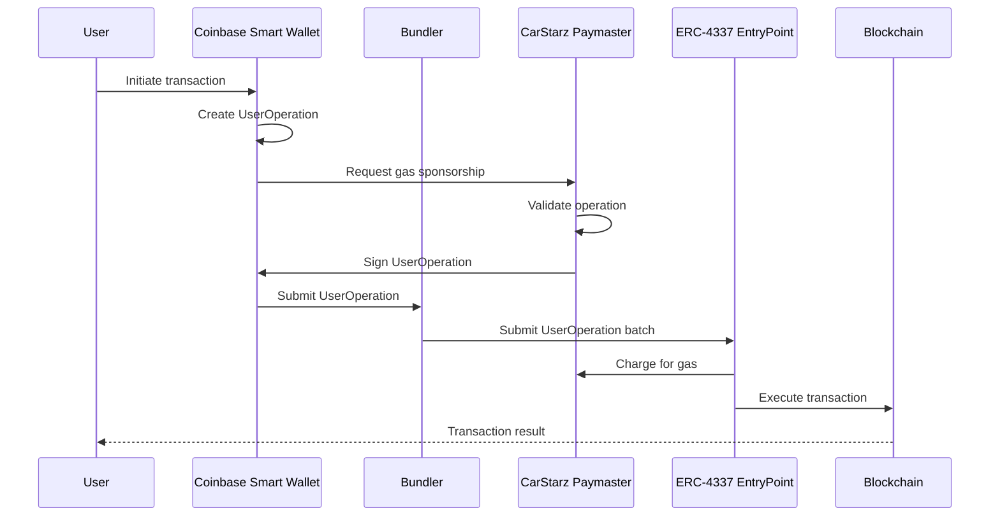
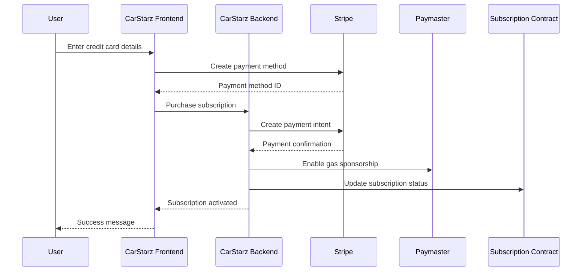

# Paymaster Implementation Guide for CarStarz

## Understanding Paymasters in Account Abstraction

A paymaster is a smart contract that can sponsor gas fees for users' transactions in the context of ERC-4337 account abstraction. This is one of the most powerful features of account abstraction as it allows for:

1. **Gasless transactions** - Users can interact with the blockchain without needing to own any ETH
2. **Sponsored operations** - Applications can cover gas costs for specific user actions
3. **Alternative payment methods** - Users can pay for gas in tokens other than ETH, or even with off-chain payment methods like credit cards

## How Paymasters Work with Coinbase Smart Wallet

Coinbase Smart Wallet implements the ERC-4337 standard, which includes support for paymasters. Here's how the flow works:



1. The user initiates a transaction through the Coinbase Smart Wallet
2. The wallet creates a "UserOperation" (not a regular transaction)
3. The wallet requests the CarStarz paymaster to sponsor the gas
4. The paymaster validates the operation based on our business rules
5. If approved, the paymaster signs the operation
6. The operation is submitted to a "bundler" which batches multiple operations
7. The bundler submits the batch to the ERC-4337 EntryPoint contract
8. The EntryPoint charges the paymaster for the gas
9. The transaction is executed on the blockchain

## Implementing a CarStarz Paymaster

### 1. Paymaster Smart Contract

First, we need to deploy a paymaster smart contract. Here's a simplified example:

```solidity
// SPDX-License-Identifier: MIT
pragma solidity ^0.8.12;

import "@account-abstraction/contracts/core/BasePaymaster.sol";

contract CarStarzPaymaster is BasePaymaster {
    // Mapping to track user gas allowances
    mapping(address => uint256) public userGasAllowance;
    
    // Mapping to track subscription status
    mapping(address => bool) public hasActiveSubscription;
    
    // Owner can fund the paymaster
    function deposit() public payable {
        // Add funds to the paymaster's deposit in the EntryPoint
        entryPoint.depositTo{value: msg.value}(address(this));
    }
    
    // Grant gas allowance to a user
    function grantGasAllowance(address user, uint256 allowance) external onlyOwner {
        userGasAllowance[user] = allowance;
    }
    
    // Set subscription status
    function setSubscriptionStatus(address user, bool active) external onlyOwner {
        hasActiveSubscription[user] = active;
    }
    
    // Validate the UserOperation
    function _validatePaymasterUserOp(
        UserOperation calldata userOp,
        bytes32 userOpHash,
        uint256 maxCost
    ) internal override returns (bytes memory context, uint256 validationData) {
        // Extract the wallet address from the userOp
        address wallet = userOp.sender;
        
        // Check if this is a subscription payment
        bool isSubscriptionPayment = _isSubscriptionPayment(userOp);
        
        // Allow subscription payments regardless of allowance
        if (isSubscriptionPayment) {
            return (abi.encode(wallet, true), 0);
        }
        
        // For other operations, check if user has an active subscription or gas allowance
        if (hasActiveSubscription[wallet] || userGasAllowance[wallet] >= maxCost) {
            // If user has gas allowance, reduce it
            if (!hasActiveSubscription[wallet]) {
                userGasAllowance[wallet] -= maxCost;
            }
            
            // Approve the operation
            return (abi.encode(wallet, false), 0);
        }
        
        // Reject the operation if user doesn't have allowance or subscription
        revert("CarStarzPaymaster: Insufficient gas allowance");
    }
    
    // Check if the operation is a subscription payment
    function _isSubscriptionPayment(UserOperation calldata userOp) internal pure returns (bool) {
        // Check if the call is to our subscription contract
        // This is a simplified example - in reality, we'd check the target contract and function signature
        bytes4 functionSelector = bytes4(userOp.callData[:4]);
        return functionSelector == bytes4(keccak256("purchaseSubscription(uint256)"));
    }
    
    // Post-operation processing
    function _postOp(
        PostOpMode mode,
        bytes calldata context,
        uint256 actualGasCost
    ) internal override {
        // Handle post-operation logic if needed
        // For example, we could update user statistics or trigger events
    }
}
```

### 2. Backend Paymaster Service

We'll need a backend service to manage the paymaster:

```typescript
// packages/backend/services/paymasterService.ts
import { ethers } from 'ethers';
import { CarStarzPaymaster__factory } from '../typechain';

export class PaymasterService {
  private provider: ethers.providers.JsonRpcProvider;
  private wallet: ethers.Wallet;
  private paymaster: ethers.Contract;
  
  constructor(
    providerUrl: string,
    privateKey: string,
    paymasterAddress: string
  ) {
    this.provider = new ethers.providers.JsonRpcProvider(providerUrl);
    this.wallet = new ethers.Wallet(privateKey, this.provider);
    this.paymaster = CarStarzPaymaster__factory.connect(paymasterAddress, this.wallet);
  }
  
  // Fund the paymaster with ETH
  async fundPaymaster(amount: string) {
    const tx = await this.paymaster.deposit({
      value: ethers.utils.parseEther(amount)
    });
    return tx.wait();
  }
  
  // Grant gas allowance to a user
  async grantGasAllowance(userAddress: string, allowance: string) {
    const tx = await this.paymaster.grantGasAllowance(
      userAddress,
      ethers.utils.parseEther(allowance)
    );
    return tx.wait();
  }
  
  // Set subscription status for a user
  async setSubscriptionStatus(userAddress: string, active: boolean) {
    const tx = await this.paymaster.setSubscriptionStatus(userAddress, active);
    return tx.wait();
  }
  
  // Check remaining gas allowance for a user
  async checkGasAllowance(userAddress: string): Promise<string> {
    const allowance = await this.paymaster.userGasAllowance(userAddress);
    return ethers.utils.formatEther(allowance);
  }
  
  // Check if user has active subscription
  async hasActiveSubscription(userAddress: string): Promise<boolean> {
    return this.paymaster.hasActiveSubscription(userAddress);
  }
}
```

### 3. Paymaster API Endpoint

We'll need an API endpoint for the Coinbase Smart Wallet to interact with our paymaster:

```typescript
// packages/nextjs/pages/api/paymaster/index.ts
import { NextApiRequest, NextApiResponse } from 'next';
import { PaymasterService } from '../../../services/paymasterService';
import { verifySignature } from '../../../utils/auth';

// Initialize paymaster service
const paymasterService = new PaymasterService(
  process.env.RPC_URL!,
  process.env.PAYMASTER_PRIVATE_KEY!,
  process.env.PAYMASTER_ADDRESS!
);

export default async function handler(req: NextApiRequest, res: NextApiResponse) {
  if (req.method !== 'POST') {
    return res.status(405).json({ error: 'Method not allowed' });
  }
  
  try {
    const { userOp, signature } = req.body;
    
    // Verify the signature to ensure the request is legitimate
    const isValid = verifySignature(userOp, signature);
    if (!isValid) {
      return res.status(401).json({ error: 'Invalid signature' });
    }
    
    // Extract wallet address from userOp
    const walletAddress = userOp.sender;
    
    // Check if this is a subscription payment
    const isSubscriptionPayment = userOp.callData.startsWith('0x12345678'); // Example function selector
    
    // Check if user has permission to use the paymaster
    const hasSubscription = await paymasterService.hasActiveSubscription(walletAddress);
    const gasAllowance = await paymasterService.checkGasAllowance(walletAddress);
    
    // Allow if it's a subscription payment or user has allowance/subscription
    if (isSubscriptionPayment || hasSubscription || parseFloat(gasAllowance) > 0) {
      // Sign the userOp with the paymaster
      const signedUserOp = await signUserOp(userOp);
      
      return res.status(200).json({ signedUserOp });
    }
    
    return res.status(403).json({ error: 'Insufficient gas allowance' });
  } catch (error) {
    console.error('Paymaster error:', error);
    return res.status(500).json({ error: 'Internal server error' });
  }
}

// Function to sign the userOp with the paymaster
async function signUserOp(userOp: any) {
  // Implementation depends on the specific ERC-4337 library being used
  // This is a placeholder for the actual signing logic
  return userOp;
}
```

## Funding Gas for Users

There are several strategies for funding gas for users:

### 1. Free Gas Allowance for New Users

To onboard new users smoothly, we can provide a free gas allowance:

```typescript
// packages/nextjs/hooks/useOnboarding.ts
import { useAuth } from '~/lib/auth/AuthContext';

export function useOnboarding() {
  const { walletAddress, walletType } = useAuth();
  
  const startOnboarding = async () => {
    if (!walletAddress || walletType !== 'smart-wallet') {
      throw new Error('Smart wallet required for onboarding');
    }
    
    try {
      // Grant initial gas allowance to the new user
      const response = await fetch('/api/onboarding/grant-gas', {
        method: 'POST',
        headers: {
          'Content-Type': 'application/json',
        },
        body: JSON.stringify({ walletAddress }),
      });
      
      if (!response.ok) {
        throw new Error('Failed to grant gas allowance');
      }
      
      const { success, allowance } = await response.json();
      
      return { success, allowance };
    } catch (error) {
      console.error('Onboarding error:', error);
      throw error;
    }
  };
  
  return { startOnboarding };
}
```

### 2. Subscription-Based Gas Funding

For users with active subscriptions, we can cover all their gas costs:

```typescript
// packages/nextjs/pages/api/subscriptions/purchase.ts
import { NextApiRequest, NextApiResponse } from 'next';
import { supabase } from '../../../lib/supabase';
import { PaymasterService } from '../../../services/paymasterService';
import Stripe from 'stripe';

const stripe = new Stripe(process.env.STRIPE_SECRET_KEY!);
const paymasterService = new PaymasterService(
  process.env.RPC_URL!,
  process.env.PAYMASTER_PRIVATE_KEY!,
  process.env.PAYMASTER_ADDRESS!
);

export default async function handler(req: NextApiRequest, res: NextApiResponse) {
  if (req.method !== 'POST') {
    return res.status(405).json({ error: 'Method not allowed' });
  }
  
  try {
    const { walletAddress, subscriptionTier, paymentMethodId } = req.body;
    
    // Create a Stripe payment intent
    const paymentIntent = await stripe.paymentIntents.create({
      amount: getSubscriptionPrice(subscriptionTier),
      currency: 'usd',
      payment_method: paymentMethodId,
      confirm: true,
    });
    
    if (paymentIntent.status === 'succeeded') {
      // Payment successful, activate subscription
      
      // 1. Update subscription in database
      const { error } = await supabase
        .from('users')
        .update({
          subscription_tier: subscriptionTier,
          subscription_start_date: new Date().toISOString(),
          subscription_end_date: getSubscriptionEndDate(subscriptionTier),
        })
        .eq('wallet_address', walletAddress.toLowerCase());
      
      if (error) {
        throw error;
      }
      
      // 2. Enable gas sponsorship for this wallet
      await paymasterService.setSubscriptionStatus(walletAddress, true);
      
      return res.status(200).json({
        success: true,
        message: 'Subscription activated successfully',
      });
    } else {
      return res.status(400).json({
        success: false,
        message: 'Payment failed',
      });
    }
  } catch (error) {
    console.error('Subscription error:', error);
    return res.status(500).json({ error: 'Internal server error' });
  }
}

// Helper function to get subscription price in cents
function getSubscriptionPrice(tier: string): number {
  switch (tier) {
    case 'standard':
      return 499; // $4.99
    case 'collector':
      return 2499; // $24.99
    case 'investor':
      return 9900; // $99.00
    case 'builder_standard':
      return 9900; // $99.00
    case 'builder_pro':
      return 19900; // $199.00
    case 'brand_presence':
      return 19900; // $199.00
    case 'brand_partner':
      return 49900; // $499.00
    default:
      return 0; // Free tier
  }
}

// Helper function to calculate subscription end date
function getSubscriptionEndDate(tier: string): string {
  const date = new Date();
  date.setMonth(date.getMonth() + 1); // Add 1 month
  return date.toISOString();
}
```

### 3. Action-Based Gas Funding

We can also fund specific user actions that benefit the platform:

```typescript
// packages/nextjs/hooks/useGasSponsoredAction.ts
export function useGasSponsoredAction() {
  const sponsorAction = async (actionType: string, params: any) => {
    try {
      // Request gas sponsorship for this specific action
      const response = await fetch('/api/gas-sponsorship/request', {
        method: 'POST',
        headers: {
          'Content-Type': 'application/json',
        },
        body: JSON.stringify({ actionType, params }),
      });
      
      if (!response.ok) {
        throw new Error('Failed to get gas sponsorship');
      }
      
      const { approved, reason } = await response.json();
      
      return { approved, reason };
    } catch (error) {
      console.error('Gas sponsorship error:', error);
      throw error;
    }
  };
  
  return { sponsorAction };
}
```

## Credit Card Payments for Subscriptions

Yes, this architecture enables users to purchase subscriptions with a credit card. Here's how it works:

### 1. Credit Card Payment Flow



1. The user enters their credit card details on the CarStarz website
2. The frontend creates a Stripe payment method
3. The frontend sends a request to purchase a subscription
4. The backend creates a Stripe payment intent and processes the payment
5. If successful, the backend enables gas sponsorship for the user's wallet
6. The backend also updates the subscription status in the smart contract
7. The user now has an active subscription without needing to own any cryptocurrency

### 2. Subscription Purchase Component

```tsx
// packages/nextjs/components/SubscriptionPurchase.tsx
import { useState } from 'react';
import { useAuth } from '~/lib/auth/AuthContext';
import { CardElement, useStripe, useElements } from '@stripe/react-stripe-js';

export function SubscriptionPurchase({ tier, price }: { tier: string, price: number }) {
  const { walletAddress, walletType } = useAuth();
  const stripe = useStripe();
  const elements = useElements();
  const [loading, setLoading] = useState(false);
  const [error, setError] = useState<string | null>(null);
  const [success, setSuccess] = useState(false);
  
  const handleSubmit = async (event: React.FormEvent) => {
    event.preventDefault();
    
    if (!stripe || !elements || !walletAddress) {
      return;
    }
    
    setLoading(true);
    setError(null);
    
    try {
      // Create payment method
      const cardElement = elements.getElement(CardElement);
      if (!cardElement) {
        throw new Error('Card element not found');
      }
      
      const { error: stripeError, paymentMethod } = await stripe.createPaymentMethod({
        type: 'card',
        card: cardElement,
      });
      
      if (stripeError) {
        throw new Error(stripeError.message);
      }
      
      // Purchase subscription
      const response = await fetch('/api/subscriptions/purchase', {
        method: 'POST',
        headers: {
          'Content-Type': 'application/json',
        },
        body: JSON.stringify({
          walletAddress,
          subscriptionTier: tier,
          paymentMethodId: paymentMethod.id,
        }),
      });
      
      const data = await response.json();
      
      if (!response.ok) {
        throw new Error(data.error || 'Failed to purchase subscription');
      }
      
      // Success!
      setSuccess(true);
      
      // If using smart wallet, we can now perform gasless transactions
      if (walletType === 'smart-wallet') {
        // The backend has already enabled gas sponsorship
        // We can now use the wallet without gas fees
      }
    } catch (error: any) {
      console.error('Subscription error:', error);
      setError(error.message || 'An error occurred');
    } finally {
      setLoading(false);
    }
  };
  
  if (success) {
    return (
      <div className="card bg-success text-success-content">
        <div className="card-body">
          <h2 className="card-title">Subscription Activated!</h2>
          <p>Your {tier} subscription has been successfully activated.</p>
          <p>You can now use all features without gas fees!</p>
        </div>
      </div>
    );
  }
  
  return (
    <div className="card bg-base-100 shadow-xl">
      <div className="card-body">
        <h2 className="card-title">{tier} Subscription</h2>
        <p className="text-lg font-bold">${(price / 100).toFixed(2)}/month</p>
        
        <form onSubmit={handleSubmit} className="mt-4">
          <div className="form-control">
            <label className="label">
              <span className="label-text">Card Details</span>
            </label>
            <div className="bg-base-200 p-3 rounded-lg">
              <CardElement options={{ style: { base: { fontSize: '16px' } } }} />
            </div>
          </div>
          
          {error && <div className="alert alert-error mt-4">{error}</div>}
          
          <div className="card-actions justify-end mt-6">
            <button 
              type="submit" 
              className="btn btn-primary"
              disabled={!stripe || loading}
            >
              {loading ? 'Processing...' : 'Subscribe Now'}
            </button>
          </div>
        </form>
      </div>
    </div>
  );
}
```

### 3. Backend Subscription Management

The backend needs to manage subscriptions and paymaster allowances:

```typescript
// packages/nextjs/pages/api/subscriptions/manage.ts
import { NextApiRequest, NextApiResponse } from 'next';
import { supabase } from '../../../lib/supabase';
import { PaymasterService } from '../../../services/paymasterService';

const paymasterService = new PaymasterService(
  process.env.RPC_URL!,
  process.env.PAYMASTER_PRIVATE_KEY!,
  process.env.PAYMASTER_ADDRESS!
);

export default async function handler(req: NextApiRequest, res: NextApiResponse) {
  if (req.method !== 'POST') {
    return res.status(405).json({ error: 'Method not allowed' });
  }
  
  try {
    const { action, walletAddress } = req.body;
    
    switch (action) {
      case 'check':
        // Check subscription status
        const { data, error } = await supabase
          .from('users')
          .select('subscription_tier, subscription_end_date')
          .eq('wallet_address', walletAddress.toLowerCase())
          .single();
          
        if (error) {
          throw error;
        }
        
        const isActive = data.subscription_tier !== 'free' && 
          new Date(data.subscription_end_date) > new Date();
          
        // Ensure paymaster status matches database
        if (isActive) {
          await paymasterService.setSubscriptionStatus(walletAddress, true);
        } else {
          await paymasterService.setSubscriptionStatus(walletAddress, false);
        }
        
        return res.status(200).json({
          isActive,
          tier: data.subscription_tier,
          endDate: data.subscription_end_date,
        });
        
      case 'cancel':
        // Cancel subscription
        const { error: cancelError } = await supabase
          .from('users')
          .update({
            subscription_tier: 'free',
          })
          .eq('wallet_address', walletAddress.toLowerCase());
          
        if (cancelError) {
          throw cancelError;
        }
        
        // Disable gas sponsorship
        await paymasterService.setSubscriptionStatus(walletAddress, false);
        
        return res.status(200).json({
          success: true,
          message: 'Subscription cancelled successfully',
        });
        
      default:
        return res.status(400).json({ error: 'Invalid action' });
    }
  } catch (error) {
    console.error('Subscription management error:', error);
    return res.status(500).json({ error: 'Internal server error' });
  }
}
```

## Monitoring and Managing Gas Costs

To ensure the sustainability of our gas sponsorship program, we need to monitor and manage costs:

### 1. Gas Usage Dashboard

```tsx
// packages/nextjs/components/admin/GasUsageDashboard.tsx
import { useState, useEffect } from 'react';
import { Bar } from 'react-chartjs-2';

export function GasUsageDashboard() {
  const [data, setData] = useState<any>(null);
  const [loading, setLoading] = useState(true);
  const [error, setError] = useState<string | null>(null);
  const [timeframe, setTimeframe] = useState('day');
  
  useEffect(() => {
    const fetchData = async () => {
      try {
        setLoading(true);
        
        const response = await fetch(`/api/admin/gas-usage?timeframe=${timeframe}`);
        
        if (!response.ok) {
          throw new Error('Failed to fetch gas usage data');
        }
        
        const data = await response.json();
        setData(data);
      } catch (error: any) {
        console.error('Gas usage error:', error);
        setError(error.message || 'An error occurred');
      } finally {
        setLoading(false);
      }
    };
    
    fetchData();
  }, [timeframe]);
  
  if (loading) {
    return <div>Loading gas usage data...</div>;
  }
  
  if (error) {
    return <div className="alert alert-error">{error}</div>;
  }
  
  if (!data) {
    return <div>No data available</div>;
  }
  
  return (
    <div className="card bg-base-100 shadow-xl">
      <div className="card-body">
        <h2 className="card-title">Gas Usage Dashboard</h2>
        
        <div className="flex justify-end mb-4">
          <div className="btn-group">
            <button 
              className={`btn ${timeframe === 'day' ? 'btn-active' : ''}`}
              onClick={() => setTimeframe('day')}
            >
              Day
            </button>
            <button 
              className={`btn ${timeframe === 'week' ? 'btn-active' : ''}`}
              onClick={() => setTimeframe('week')}
            >
              Week
            </button>
            <button 
              className={`btn ${timeframe === 'month' ? 'btn-active' : ''}`}
              onClick={() => setTimeframe('month')}
            >
              Month
            </button>
          </div>
        </div>
        
        <div className="h-80">
          <Bar data={data.chartData} options={data.chartOptions} />
        </div>
        
        <div className="grid grid-cols-1 md:grid-cols-3 gap-4 mt-6">
          <div className="stat bg-base-200 rounded-lg p-4">
            <div className="stat-title">Total Gas Used</div>
            <div className="stat-value">{data.totalGas} ETH</div>
            <div className="stat-desc">≈ ${data.totalGasUsd}</div>
          </div>
          
          <div className="stat bg-base-200 rounded-lg p-4">
            <div className="stat-title">Average Per User</div>
            <div className="stat-value">{data.averageGas} ETH</div>
            <div className="stat-desc">≈ ${data.averageGasUsd}</div>
          </div>
          
          <div className="stat bg-base-200 rounded-lg p-4">
            <div className="stat-title">Paymaster Balance</div>
            <div className="stat-value">{data.paymasterBalance} ETH</div>
            <div className="stat-desc">≈ ${data.paymasterBalanceUsd}</div>
          </div>
        </div>
        
        <div className="mt-6">
          <h3 className="text-lg font-bold mb-2">Top Gas Users</h3>
          <div className="overflow-x-auto">
            <table className="table w-full">
              <thead>
                <tr>
                  <th>Wallet</th>
                  <th>Subscription</th>
                  <th>Gas Used</th>
                  <th>Cost (USD)</th>
                </tr>
              </thead>
              <tbody>
                {data.topUsers.map((user: any) => (
                  <tr key={user.wallet}>
                    <td>{user.wallet}</td>
                    <td>{user.subscription}</td>
                    <td>{user.gasUsed} ETH</td>
                    <td>${user.costUsd}</td>
                  </tr>
                ))}
              </tbody>
            </table>
          </div>
        </div>
      </div>
    </div>
  );
}
```

### 2. Gas Budget Management

```typescript
// packages/nextjs/pages/api/admin/gas-budget.ts
import { NextApiRequest, NextApiResponse } from 'next';
import { PaymasterService } from '../../../services/paymasterService';
import { ethers } from 'ethers';

const paymasterService = new PaymasterService(
  process.env.RPC_URL!,
  process.env.PAYMASTER_PRIVATE_KEY!,
  process.env.PAYMASTER_ADDRESS!
);

export default async function handler(req: NextApiRequest, res: NextApiResponse) {
  if (req.method !== 'POST') {
    return res.status(405).json({ error: 'Method not allowed' });
  }
  
  try {
    const { action, amount } = req.body;
    
    switch (action) {
      case 'fund':
        // Fund the paymaster with ETH
        const tx = await paymasterService.fundPaymaster(amount);
        
        return res.status(200).json({
          success: true,
          message: `Successfully funded paymaster with ${amount} ETH`,
          txHash: tx.transactionHash,
        });
        
      case 'adjust_limits':
        // Adjust gas limits for different subscription tiers
        const { tier, limit } = req.body;
        
        // Update gas limits in database
        // This is a simplified example - in reality, we'd update a database table
        
        return res.status(200).json({
          success: true,
          message: `Updated gas limit for ${tier} tier to ${limit} ETH`,
        });
        
      default:
        return res.status(400).json({ error: 'Invalid action' });
    }
  } catch (error) {
    console.error('Gas budget error:', error);
    return res.status(500).json({ error: 'Internal server error' });
  }
}
```

## Conclusion

Implementing a paymaster with Coinbase Smart Wallet enables CarStarz to:

1. **Eliminate Gas Barriers**: Users can interact with the platform without needing to own ETH
2. **Support Credit Card Payments**: Users can purchase subscriptions with traditional payment methods
3. **Create a Seamless Experience**: The complexity of blockchain transactions is hidden from users
4. **Implement Sustainable Economics**: Gas costs are covered by subscription revenue

This approach maintains the benefits of blockchain technology (ownership, transparency, interoperability) while providing a user experience comparable to traditional web2 applications. It's a critical component of our progressive decentralization strategy, allowing us to onboard mainstream users while gradually introducing them to the benefits of web3.