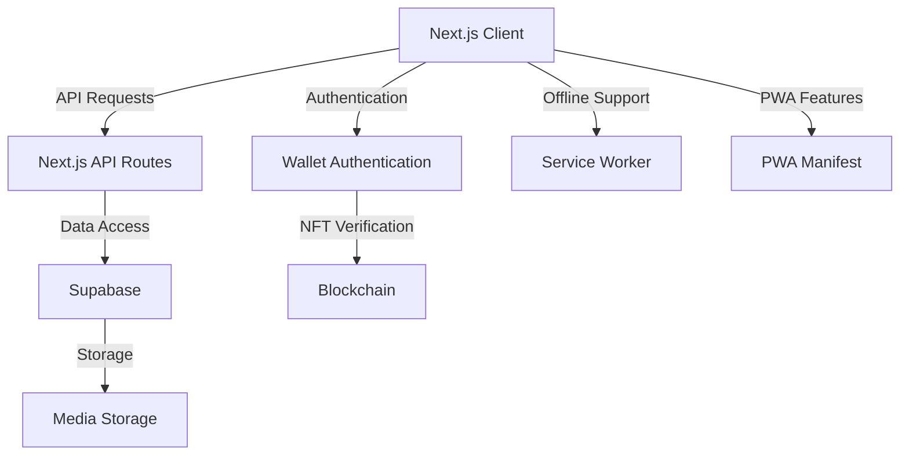
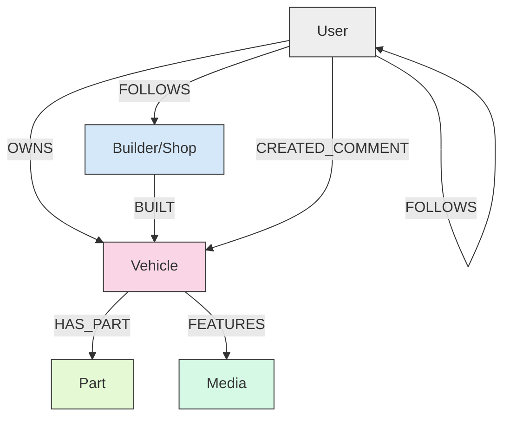

# 🚗 CarStarz

A social platform centered around vehicle profiles, connecting owners, builders, parts, and shops through NFT-backed vehicle registrations.

## Overview

CarStarz is a decentralized application that allows vehicle owners to showcase their vehicles with rich media and detailed specifications. The platform creates value through well-defined relationships between vehicles, owners, builders, parts, and shops, all secured by blockchain technology.

**Current Status**: Active development (not yet released)

### Vision

CarStarz will be a social platform centered around vehicle profiles, where:

- Vehicle owners can showcase their vehicles with rich media and detailed specifications
- Vehicle profiles serve as shareable content for social media (especially Instagram)
- Profiles link to parts (enabling affiliate revenue) and shops that did work on the vehicle
- The platform creates value through well-defined relationships between vehicles, owners, builders, parts, and shops
- A freemium model allows basic usage for free with tiered subscriptions for enhanced features

## Core Features

### For Vehicle Owners

- **NFT-backed vehicle profiles**: Secure ownership of your vehicle's digital identity
- **Rich media galleries**: Showcase your vehicle with high-quality images and videos
- **Detailed specifications**: Document every aspect of your vehicle
- **Modification tracking**: Record all modifications, upgrades, and maintenance
- **Social sharing**: Share your vehicle profile on social media platforms
- **Builder connections**: Link to shops and builders who worked on your vehicle
- **Parts documentation**: Track and showcase parts used in your build

#### Vehicle Owner Subscription Tiers

1. **Free Tier**
   - Create a profile
   - Mint 1 vehicle with basic features
   - View all content on the platform
   - Basic social interactions (comments, likes)

2. **Standard Tier** ($4.99/month)
   - 1-3 vehicles
   - Advanced features (enhanced media galleries, custom fields)
   - Affiliate marketing options
   - Analytics dashboard
   - Priority support

3. **Collector Tier** ($24.99/month)
   - 4-9 vehicles
   - All standard tier features
   - Enhanced analytics
   - Custom branding options
   - Featured placement in discovery

4. **Investor Tier** ($99/month)
   - 10+ vehicles
   - All collector tier features
   - API access
   - White-label options
   - Dedicated support

### For Builders/Shops

- **Professional profiles**: Showcase your business and specialties
- **Portfolio showcase**: Display vehicles you've worked on
- **Customer connections**: Connect with vehicle owners on the platform
- **Work documentation**: Document your builds and modifications
- **Business growth**: Attract new customers through your portfolio

#### Builder/Shop Subscription Tiers

1. **Builder/Shop Standard** ($99/month)
   - Professional profile
   - Portfolio showcase (unlimited vehicles)
   - Business contact information
   - Advanced analytics
   - **Integration Features:**
     - Send invitation links to customers to create vehicles
     - Link customer vehicles to builder portfolio
     - Request connection to existing vehicle owners
     - Receive connection requests from vehicle owners
     - Collaborative build documentation

2. **Builder/Shop Pro** ($199/month)
   - All Standard features
   - Featured placement in builder directory
   - Appointment booking system
   - Lead generation tools
   - Custom branding options
   - **Enhanced Integration:**
     - Bulk invitation management
     - Customer relationship management tools
     - Build progress tracking and sharing
     - Parts recommendation engine

3. **Enterprise** (Custom pricing)
   - All Pro features
   - White-label solutions
   - API integration
   - Custom features
   - Dedicated account manager
   - Marketing partnership opportunities
   - **Advanced Integration:**
     - Custom workflow automation
     - Integration with shop management software
     - Customer loyalty program tools

### For Enthusiasts

- **Discover unique vehicles**: Browse and search for interesting vehicles
- **Follow favorite builders**: Stay updated on their latest projects
- **Engage with the community**: Comment, like, and share
- **Learn about modifications**: Get inspired for your own projects
- **Find parts and services**: Discover parts and shops for your own vehicle

### Business Model

CarStarz operates on a freemium business model with multiple revenue streams:

1. **Subscription Tiers**: Tiered pricing for vehicle owners and businesses
2. **Affiliate Marketing**: Revenue from parts and service referrals
3. **Featured Listings**: Promoted vehicles and businesses
4. **Premium Content**: Exclusive content and features
5. **API Access**: For enterprise customers and integrations

## Technical Architecture

CarStarz is built using modern web technologies and blockchain integration:



### Technology Stack

- **Frontend**: Next.js, Tailwind CSS, RainbowKit, Wagmi
- **Backend**: Next.js API Routes, Supabase
- **Database**: PostgreSQL (via Supabase)
- **Blockchain**: Ethereum (Hardhat for development)
- **Authentication**: Wallet-based authentication with SIWE (Sign-In With Ethereum)
- **Storage**: Supabase Storage for media files
- **Smart Contracts**: Solidity (VehicleRegistry.sol)

### Core Data Model

The application is built around a relational database model that represents entities and their relationships:



### Key Entities

1. **Vehicle**
   - Properties: token_id (NFT identifier), vin, make, model, year, name, description
   - Relationships: owned by User, built by Builder, has Parts, features Media

2. **User**
   - Properties: wallet_address, user_type, subscription_tier, profile_data
   - Relationships: owns Vehicles, follows Users/Builders, creates Comments

3. **Builder/Shop**
   - Properties: business_name, business_type, contact_info, subscription_tier, specialties
   - Relationships: builds Vehicles, followed by Users

4. **Part**
   - Properties: category, description, link
   - Relationships: belongs to Vehicle

5. **Media**
   - Properties: url, type (image, video), caption, is_featured
   - Relationships: belongs to Vehicle

## Setup Instructions

### Prerequisites

- [Node.js](https://nodejs.org/) (>= v20.18.3)
- [Yarn](https://yarnpkg.com/) (v1 or v2+)
- [Git](https://git-scm.com/)
- [Supabase](https://supabase.com/) account

### Environment Variables

Create a `.env.local` file in the `packages/nextjs` directory with the following variables:

```
# Supabase
NEXT_PUBLIC_SUPABASE_URL=your_supabase_url
NEXT_PUBLIC_SUPABASE_ANON_KEY=your_supabase_anon_key
SUPABASE_SERVICE_ROLE_KEY=your_supabase_service_role_key

# Blockchain
NEXT_PUBLIC_RPC_URL=your_rpc_url
NEXT_PUBLIC_CHAIN_ID=31337 # For local development
```

### Supabase Setup

1. Create a new Supabase project
2. Run the database migrations from `infrastructure/database/migrations/consolidated-schema.sql`
3. Set up storage buckets for vehicle media

### Installation and Development

1. Clone the repository:
   ```bash
   git clone https://github.com/your-username/carstarz.git
   cd carstarz
   ```

2. Install dependencies:
   ```bash
   yarn install
   ```

3. Start a local blockchain:
   ```bash
   yarn chain
   ```

4. Deploy the smart contracts:
   ```bash
   yarn deploy
   ```

5. Start the development server:
   ```bash
   yarn start
   ```

6. Open [http://localhost:3000](http://localhost:3000) in your browser

### Identity System Setup

The identity system requires additional configuration:

1. Run the identity registry setup script:
   ```bash
   yarn setup:identity
   ```

2. Configure wallet normalization:
   ```bash
   yarn setup:wallet-normalization
   ```

## Development Roadmap

### Current Status

- Core vehicle profile system implemented
- NFT minting and ownership tracking
- Basic user profiles and authentication
- Media management for vehicle profiles

### In Progress

- Enhanced authentication with Coinbase Smart Wallet
- Improved media management
- Subscription tier implementation
- Builder/shop profiles

### Planned Features

- PWA capabilities with offline support
- Enhanced social features
- Parts integration with affiliate links
- Analytics dashboard
- Mobile app

## Contributing

We welcome contributions to CarStarz! Please see [CONTRIBUTING.md](CONTRIBUTING.md) for more information and guidelines for contributing.

## License

This project is licensed under the MIT License - see the [LICENSE](LICENSE) file for details.